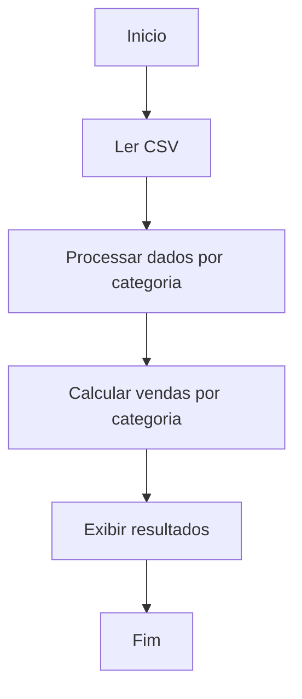

# Template de Projeto (PT-BR, ASCII)

## 1) Brief
- Problema: consolidar e analisar vendas por categoria a partir de um CSV de produtos.
- Contexto: desafio de funcoes em Python com leitura e processamento de dados.
- Objetivo principal: calcular e reportar o total de vendas por categoria.
- Escopo (o que entra / o que nao entra): entra leitura do CSV, transformacao em dicionario e calculo de totais; nao entra visualizacao avancada nem persistencia em banco.
- Impacto esperado: praticar decomposicao, funcoes e estrutura de dados.

## 2) Requisitos
### Funcionais
- RF-01: ler o arquivo CSV e carregar os dados em memoria.
- RF-02: organizar os dados por categoria com listas de produtos.
- RF-03: calcular o total de vendas por categoria (quantidade * valor).
- RF-04: exibir ou retornar os totais por categoria.

### Nao funcionais
- RNF-01: usar funcoes separadas para cada etapa.
- RNF-02: codigo simples e legivel.

## 3) Entradas e saidas
- Entradas (dados, formatos, origem): arquivo CSV com colunas de produto, categoria, quantidade e valor de venda.
- Saidas (formato, destino): dicionario com total de vendas por categoria (exibido no console).
- Regras de negocio: total por categoria = soma de (quantidade * valor) de todos os produtos daquela categoria.

## 4) Casos de uso e cenarios
- Caso principal: CSV valido com varias categorias e produtos.
- Casos alternativos: CSV com uma unica categoria; CSV com apenas um produto.
- Erros esperados: arquivo inexistente; colunas faltando; valores nao numericos.

## 5) Decomposicao do problema
- Modulo / etapa 1: ler CSV (funçao `ler_csv`).
- Modulo / etapa 2: processar dados em dicionario por categoria (funçao `processar_dados`).
- Modulo / etapa 3: calcular totais por categoria (funçao `calcular_vendas_categoria`).

## 6) Fluxograma (mermaid)


## 7) Pseudocodigo
```
INICIO
  dados <- ler_csv(arquivo)
  dados_por_categoria <- processar_dados(dados)
  totais <- calcular_vendas_categoria(dados_por_categoria)
  exibir(totais)
FIM
```

## 8) Implementacao (alto nivel)
- Linguagem / stack: Python
- Estrutura de pastas: arquivo unico (ex.: desafio.py) com funcoes.
- Principais funcoes / modulos: ler_csv, processar_dados, calcular_vendas_categoria.

## 9) Testes e validacao
- Casos de teste minimos: CSV com 2 categorias e 2 produtos cada.
- Dados de exemplo: 4 linhas de vendas com quantidade e valor conhecidos.
- Criterios de aceite: totais corretos por categoria, sem erro de leitura.

## 10) Riscos e limites
- Risco 1: dados mal formatados no CSV.
- Risco 2: valores nao numericos em quantidade ou venda.
- Limites conhecidos: nao trata validacao profunda nem dados faltantes.

## 11) Proximos passos
- Passo 1: implementar as funcoes no arquivo de desafio.
- Passo 2: rodar com CSV de exemplo e validar totais.
- Passo 3: refinar validacoes e mensagens de erro.
