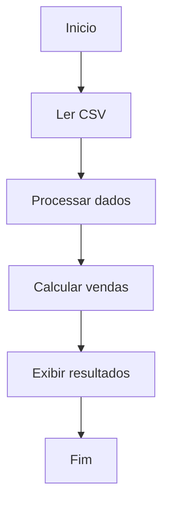

# Aula 07 - Funções em Python e Estrutura de Dados

## 📋 Sobre

Aula 07 focada em funcoes, decomposicao do problema e organizacao de um fluxo simples
de ETL a partir de um CSV de vendas. O desafio consiste em ler os dados, processar
por categoria e calcular o total de vendas.


As funções em Python são uma das estruturas fundamentais da linguagem, permitindo a reutilização de código, a organização e a modularidade dos programas. Este guia aborda desde a motivação até a aplicação prática de funções, incluindo keywords, nomes, e como utilizá-las efetivamente.

## 🎯 Objetivos de Aprendizado

- Definir funcoes claras para cada etapa do fluxo.
- Praticar type hints com `TypedDict`, listas e dicionarios.
- Ler CSV com `csv.DictReader`.
- Separar ETL (funcoes) do pipeline (orquestracao).

## 📁 Estrutura do Projeto

```
.
|-- etl.py
|-- pipeline.py
|-- PLANEJAMENTO.md
|-- README.md
`-- vendas.csv
```

## 🛠️ Tecnologias e Ferramentas

- Python 3.11
- csv (leitura de CSV)
- pathlib (caminhos)
- type hints (TypedDict, list, dict)

## 🚀 Como Usar

Execute o pipeline a partir da pasta da aula:

```bash
python pipeline.py
```

## 📚 Conteudo Real


### Motivação

A principal motivação para usar funções em Python é a **reutilização de código**. Funções permitem que você escreva um bloco de código uma vez e o execute múltiplas vezes, possivelmente com diferentes argumentos, para produzir diferentes resultados. Isso ajuda a tornar o código mais **legível**, **modular**, e **fácil de debugar**.

### Definindo Funções

Para criar uma função em Python, você usa a keyword `def`, seguida de um nome de função, parênteses `()` contendo zero ou mais "parâmetros", e dois pontos `:`. O bloco de código indentado que segue é o corpo da função.

```python
def minha_funcao():
    return "Hello, World!"
```

### Nomes de Funções

Os nomes das funções seguem as mesmas regras de nomes de variáveis em Python: podem conter letras, números (não como primeiro caractere) e underscores (`_`), mas não espaços ou caracteres especiais. Nomes de funções devem ser descritivos e, por convenção, utilizam `snake_case`.

### Parâmetros e Argumentos

* **Parâmetros** são as variáveis listadas nos parênteses na definição da função. Eles são como placeholders para os dados que a função irá processar.

* **Argumentos** são os valores reais passados para a função quando ela é chamada.


```python
def soma(a, b):
    return a + b
```

### Palavras-chave importantes

* `def` inicia a definição de uma função.
* `return` é usado para retornar um valor da função. Se omitido, a função retorna `None` por padrão.
* `pass` pode ser usado como um placeholder para uma função vazia, significando "nada".

### Chamando Funções

Para chamar uma função, use o nome da função seguido por parênteses contendo os argumentos necessários.

```python
resultado = soma(5, 3)
print(resultado)  # Saída: 8
```

### Valores Padrão e Argumentos Nomeados

Funções podem ter parâmetros com valores padrão, permitindo que sejam chamadas com menos argumentos.

```python
def cumprimentar(nome, mensagem="Olá"):
    print(f"{mensagem}, {nome}!")
```

Você também pode chamar funções com argumentos nomeados para maior clareza.

```python
cumprimentar(mensagem="Bem-vindo", nome="João")
```

**Fluxo**:



**Tarefas**:

1. Ler o arquivo CSV e carregar os dados.
2. Processar os dados em um dicionário por categoria.
3. Calcular o total de vendas por categoria.

### Funções

- `etl.py`: funções puras para leitura e transformação dos dados.
  - `ler_csv`: carrega o CSV em lista de dicionários tipados.
  - `processar_dados`: organiza os itens por categoria.
  - `calcular_vendas_categoria`: soma quantidade * venda por categoria.
  - `exibir_resultados`: imprime os totais no console.
- `pipeline.py`: orquestração do fluxo (ler -> processar -> calcular -> exibir).
- `vendas.csv`: dados de exemplo para o desafio.
- `PLANEJAMENTO.md`: planejamento do desafio com fluxo e pseudocodigo.

## 🔗 Recursos Adicionais

- https://docs.python.org/3/library/csv.html
- https://docs.python.org/3/library/typing.html

## 👤 Autor

Arthur Cardoso (arthurhfcardoso@gmail.com)
