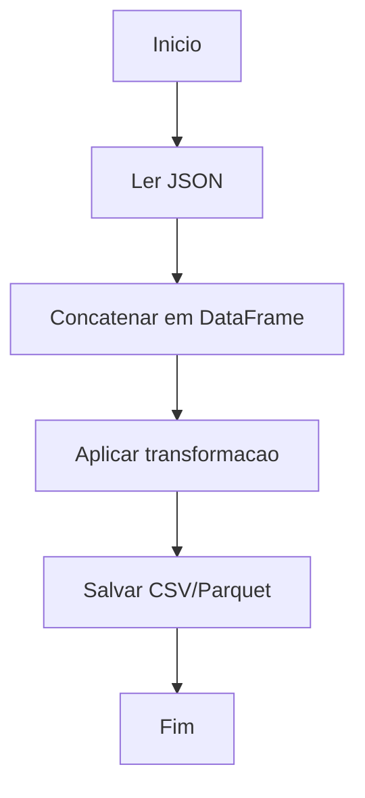

# Planejamento - Aula 08 ETL com Pandas (JSON e Parquet)

## 1) Brief
- Problema: construir uma ETL simples em Python usando Pandas.
- Contexto: aula 08 do modulo "python avancado para dados"; entrada em JSON e saida em CSV/Parquet.
- Objetivo principal: ler JSON, transformar em DataFrame unico e salvar resultado.
- Escopo (o que entra / o que nao entra): inclui leitura de JSON, concatenacao e transformacao simples, exportacao CSV/Parquet; nao inclui orquestracao, banco de dados, nem deploy.
- Impacto esperado: exercicio pratico para fixar ETL basico com Pandas.

## 2) Requisitos
### Funcionais
- RF-01: ler dados de um arquivo JSON.
- RF-02: concatenar registros em um unico DataFrame.
- RF-03: aplicar transformacao simples (ex.: normalizacao/renomeacao/coluna derivada).
- RF-04: salvar o DataFrame em CSV ou Parquet.

### Nao funcionais
- RNF-01: codigo em Python usando Pandas.
- RNF-02: script simples, executavel localmente.

## 3) Entradas e saidas
- Entradas (dados, formatos, origem): arquivo(s) JSON em `data/`.
- Saidas (formato, destino): CSV e/ou Parquet no disco local (ex.: `saidas/`).
- Regras de negocio: consolidar registros e aplicar transformacao basica.

## 4) Casos de uso e cenarios
- Caso principal: usuario executa script -> JSON lido -> DataFrame criado -> transformacao aplicada -> arquivo salvo.
- Casos alternativos: JSON vazio ou lista de arquivos JSON.
- Erros esperados: arquivo nao encontrado, JSON invalido, coluna ausente.

## 5) Decomposicao do problema
- Modulo / etapa 1: extract (ler JSON).
- Modulo / etapa 2: transform (concatenar e transformar).
- Modulo / etapa 3: load (salvar CSV/Parquet).

## 5.1) Funcoes essenciais
- carregar_json(caminho_ou_lista) -> pd.DataFrame
- transformar_df(df) -> pd.DataFrame
- validar_df(df) -> pd.DataFrame (Pandera)
- salvar_csv(df, caminho_saida) -> None
- salvar_parquet(df, caminho_saida) -> None

## 6) Fluxograma (mermaid)


## 7) Pseudocodigo
```
INICIO
  ler arquivo(s) JSON
  concatenar registros em DataFrame
  aplicar transformacao simples
  salvar em CSV ou Parquet
FIM
```

## 8) Implementacao (alto nivel)
- Linguagem / stack: Python, Pandas; qualidade de dados com Pandera (opcional: Loguru para logs).
- Estrutura de pastas: aula08/ com data/ e saidas/.
- Arquivos e responsabilidades:
  - etl.py: extracao, transformacao e carga.
  - schema.py: validacao de dados (Pandera).
  - pipeline.py: orquestracao e CLI.
- Principais funcoes / modulos: carregar_json, transformar_df, validar_df, salvar_csv, salvar_parquet.

## 9) Testes e validacao
- Casos de teste minimos: JSON valido com 1 e varios registros; JSON vazio; coluna faltante.
- Dados de exemplo: pequeno JSON de 3-5 registros.
- Criterios de aceite: arquivos gerados corretamente e transformacao aplicada.

## 10) Riscos e limites
- Risco 1: formato do JSON nao esperado (objeto vs lista).
- Risco 2: falta de dependencias (pandas, pyarrow para parquet).
- Limites conhecidos: pipeline local e simples, sem validacao avancada.

## 11) Proximos passos
- Passo 1: implementar script ETL.
- Passo 2: adicionar logging opcional.
- Passo 3: documentar execucao e exemplos.
